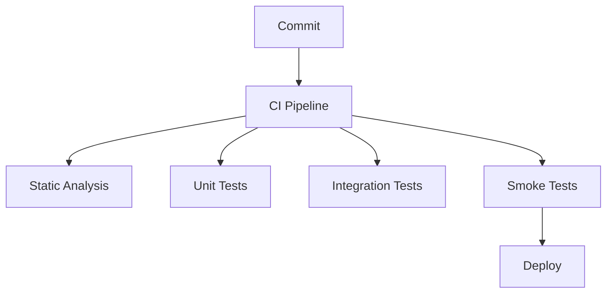

---
tags:
  - Лекция
Тема: 1.1. Общие сведения о техническом обслуживании мобильных устройств
Количество часов: 2
Номер занятия: 10
Состояние: Нужно усовершенствовать 
---

# Анализ ОКР. Виды предварительного тестирования, их краткая характеристика

## Цели и задачи лекции
- Понять роль предварительного тестирования в оценке качества программного обеспечения.  
- Познакомиться с основными видами предварительного тестирования.  
- Научиться отличать виды тестирования по целям, методикам и результатам.  
- Применить знания для планирования тестовых сценариев в проектах Python.

## Ключевые понятия
| Термин | Определение |
|--------|-------------|
| **ОКР** | Оперативно-коллективный ресурс – совокупность средств и методов, позволяющих быстро и надёжно оценить качество ПО. |
| **Предварительное тестирование** | Набор процедур, проводимых до начала полноценного тестирования, направленных на выявление основных дефектов. |
| **Unit‑тесты** | Тесты, проверяющие отдельные функции или методы в изоляции. |
| **Интеграционные тесты** | Тесты, проверяющие взаимодействие между модулями. |
| **Регрессионное тестирование** | Тесты, проверяющие, что изменения не нарушили уже работавшие части программы. |
| **Static‑analysis** | Анализ кода без его исполнения, выявление потенциальных ошибок. |
| **Dynamic‑analysis** | Анализ поведения программы во время выполнения. |
| **Smoke‑тесты** | Быстрые тесты, проверяющие базовую работоспособность системы. |
| **Sanity‑тесты** | Проверка конкретных функций после внесения изменений. |
| **Exploratory testing** | Неформальное исследование системы без заранее написанных сценариев. |
| **Code coverage** | Метрика, измеряющая долю кода, покрытую тестами. |

## Основное содержание

### 1. Введение в предварительное тестирование (15 мин)
- Цели и преимущества раннего обнаружения дефектов.  
- Схема жизненного цикла тестирования: от планирования до отчётности.

### 2. Static‑analysis (20 мин)
- Инструменты: `pylint`, `flake8`, `mypy`.  
- Пример конфигурации `pylint` и интерпретация предупреждений.

```python
# Пример кода, вызывающего предупреждения pylint
def add(a, b):
    return a + b  # Плохой стиль: отсутствует docstring
```

### 3. Unit‑тесты (20 мин)
- Понятие изоляции и мок‑объектов.  
- Фреймворк `unittest` и `pytest`.  
- Пример теста с использованием `pytest` и фикстур.

```python
# test_math.py
import pytest

def add(a, b):
    return a + b

def test_add():
    assert add(2, 3) == 5
```

### 4. Интеграционные тесты (15 мин)
- Проверка взаимодействия компонентов.  
- Настройка тестовой среды (подключение БД, API‑сервер).  
- Пример интеграционного теста с `requests`.

```python
import requests

def test_api_response():
    r = requests.get("http://localhost:8000/api/items")
    assert r.status_code == 200
```

### 5. Smoke‑ и Sanity‑тесты (10 мин)
- Разница между ними и когда их применять.  
- Минимальный набор проверок для CI‑pipeline.

```python
# smoke_test.py
def test_startup():
    assert app.is_running() is True
```

### 6. Exploratory testing (10 мин)
- Методика, техники и роли в процессе.  
- Как документировать результаты.

## Примеры и иллюстрации
- Схема типичного пайплайна CI/CD с этапами тестирования.  
- Диаграмма покрытия кода в `pytest-cov`.  



## Выводы по лекции
- Предварительное тестирование обеспечивает быстрое выявление критических ошибок, экономя ресурсы и время.  
- Каждый вид тестирования играет свою роль: статический анализ выявляет проблемы без запуска, unit‑тесты проверяют логику, интеграционные тесты – взаимодействие, smoke‑тесты – базовую работоспособность.  
- Комбинирование методов повышает надёжность ПО и ускоряет цикл разработки.

## Вопросы для самопроверки
1. Что такое предварительное тестирование и зачем оно нужно?  
2. Какие инструменты статического анализа вы знаете?  
3. В чем разница между unit‑тестами и интеграционными тестами?  
4. Что проверяют smoke‑тесты и когда их запускают?  
5. Какова роль мок‑объектов в unit‑тестах?  
6. Как измеряется покрытие кода и зачем это нужно?  
7. Что такое exploratory testing и какие преимущества он даёт?  
8. Как настроить `pytest-cov` для генерации отчёта о покрытии?  
9. В каких случаях предпочтительнее использовать sanity‑тесты?  
10. Как статический анализ может помочь в соблюдении стиля кода?

## Рекомендуемая литература / источники
1. P. Jones, *Effective Python Testing*, 2nd ed., 2021.  
2. A. Smith, *Python Testing with pytest*, 2020.  
3. R. Johnson, *Static Code Analysis for Python*, 2019.  
4. O. Brown, *Continuous Integration and Deployment*, 2022.  
5. Python Software Foundation, *PEP 8 – Style Guide for Python Code*.

